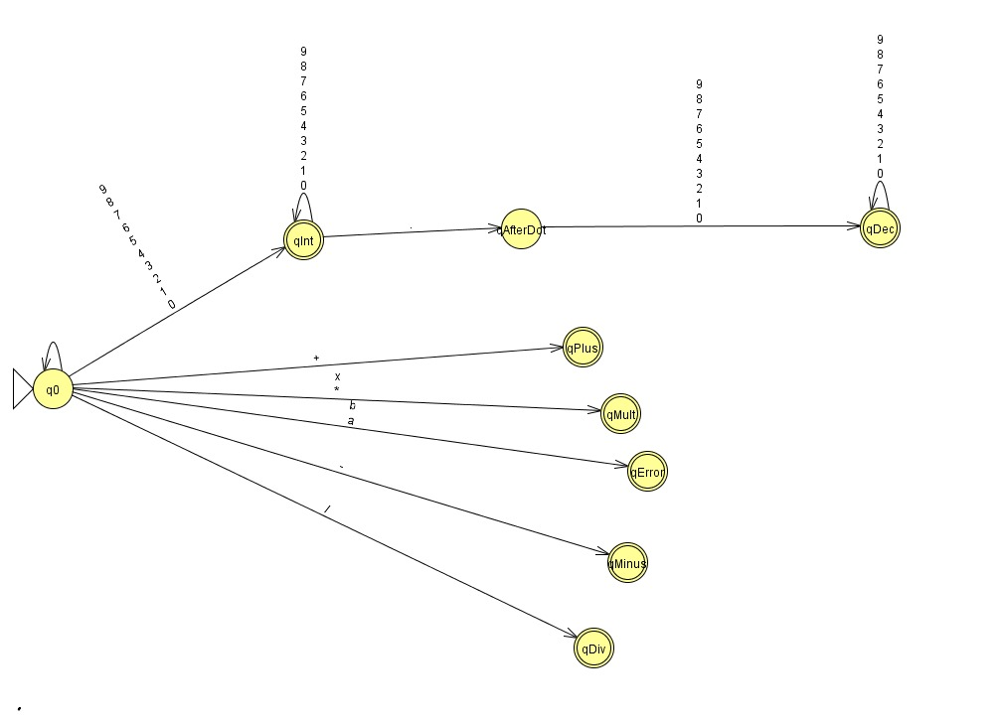
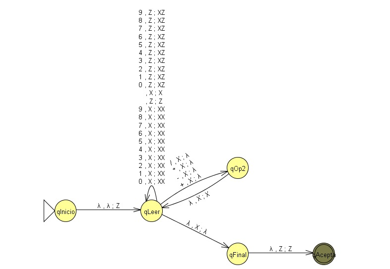

# Evaluador y Validador Postfijo con Autómata de Pila (AP)

Programa en lenguaje C que implementa un **Autómata de Pila (AP)** para la **evaluación y validación de expresiones aritméticas en notación postfija (RPN)**.  
El sistema procesa una cadena de tokens (operandos y operadores `+`, `-`, `*`, `/`) y:

- Determina si la expresión es **sintácticamente válida**.
- **Calcula el resultado numérico** de la expresión si es correcta.

---

## Contexto académico

Este proyecto fue desarrollado como **trabajo final** para el curso de **Teoría de la Computación** en la  
**Facultad de Ingeniería de Sistemas e Informática** de la **Universidad Nacional Mayor de San Marcos (UNMSM)**.

---

## ¿Qué es la notación postfija (RPN)?

En notación postfija los operadores van **después** de los operandos.  
Por ejemplo:

- Infija: `3 + 4 * 2`  
- Postfija: `3 4 2 * +`

Esta forma no necesita paréntesis ni prioridades y se puede evaluar fácilmente usando una **pila**.

---

## ¿Qué hace este programa?

Dada una expresión postfija, el programa:

1. Lee la entrada como una secuencia de tokens separados por espacios.
2. Usa una pila para ir procesando números y operadores.
3. Informa si la expresión es válida o no.
4. Muestra el **resultado numérico** cuando la expresión es correcta.
5. Reporta errores como:
   - Falta de operandos.
   - División entre cero.
   - Resultado no único en la pila al final.

---

##  Modelo teórico

El proyecto se apoya en dos niveles:

1. Un **autómata para clasificar tokens** como *operando* u *operador*.
2. Un **autómata de pila** que valida y evalúa la expresión postfija completa.

### 1. Autómata para validar si un token es operando u operador

Este autómata (finito / de pila trivial) decide si cada token leído es:

- **Operando** numérico (entero o decimal).
- **Operador aritmético** (`+`, `-`, `*`, `/`).
- **Token inválido**.



### 2. Autómata de Pila para validar la expresión postfija

El segundo autómata modela el comportamiento clásico de la pila en RPN:

- Por cada **operando** leído → apila un símbolo `X`.
- Por cada **operador binario** leído → desapila dos `X` y vuelve a apilar uno (`X`).
- La expresión es **aceptada** si al consumir toda la entrada queda exactamente un `X`
  sobre el símbolo inicial `Z` (es decir, un único resultado).



---

## Interpretación del proceso

Objetivo: calcular el resultado numérico de una expresión postfija (por ejemplo `10 5 +`).

1. Si se lee un **número**, se apila (operación *push*).
2. Si se lee un **operador** (`+`, `-`, `*`, `/`):
   - Se sacan de la pila los dos últimos números (operaciones *pop*).
   - Se aplica la operación: `resultado = operando1 operador operando2`.
   - El resultado se vuelve a apilar (*push*).
3. Al finalizar la lectura:
   - Si queda **exactamente un número** en la pila → la expresión es **VÁLIDA** y ese es el resultado.
   - Si la pila queda vacía o con más de un número → la expresión es **INVÁLIDA**.
   - Si se intenta dividir entre cero → la expresión se marca como **INVÁLIDA** por error aritmético.

---

## Estructura del repositorio

```text
AP_postfijo.c   → Código fuente en C
LICENSE         → Licencia del proyecto
README.md       → Documentación principal
```
## Requisitos
- Compilador de C (por ejemplo, `gcc`)
    - En Linux: suele venir en el paquete `build-essential`.
    - En Windows: se puede usar MinGW o WSL.
- Consola o terminal para compilar y ejecutar el programa.

## Compilación y ejecución
1. Compilar:
   ``` bash
   gcc AP_postfijo.c -o ap_postfijo
   ```
2. Ejecutar:
    ``` bash
   ./ap_postfijo
   ```
3. Ingresar la expresión postfija cuando el programa lo solicite, separando cada token con un espacio:
   ``` bash
   Ingrese la expresión postfija:
    3 4 + 2 *
   ```
## Ejemplos de uso
- **Ejemplo 1: expresión válida simple**
   - Entrada:
    ``` bash
      2 3 +
     ```
   - Salida esperada: 
    ``` bash
      Resultado: 5
   ```
- **Ejemplo 2: expresión compuesta**
  - Entrada:
    ``` bash
      3 4 + 2 *
     ```
   - Salida esperada: 
    ``` bash
      Resultado: 14
   ```
- **Ejemplo 3: operandos insuficientes**
  - Entrada:
    ``` bash
      5 +
     ```
   - Salida esperada: 
    ``` bash
      Error: faltan operandos para aplicar el operador "+"
   ```
- **Ejemplo 4: división entre cero**
  - Entrada:
    ``` bash
      4 0 /
     ```
   - Salida esperada: 
    ``` bash
      Error: División entre cero
   ```

## Características principales
- El programa simula un autómata de pila que verifica si la expresión postfija está bien formada y, en caso afirmativo, la evalúa.
- Se utilizan cuatro funciones principales que actúan como motor del programa:
   - `push` → inserta un valor en la cima de la pila.
   - `pop` → extrae el valor superior de la pila.
   - `esOperador` → reconoce si un token es un operador válido.
   - `imprimir_pila` → muestra el contenido actual de la pila (útil para entender el proceso).
- En la parte principal del programa:
   - Si se encuentra un operando, se llama a `push` y se coloca en la cima de la pila.
   - Si se encuentra un operador, se llaman a pop dos veces para obtener los operandos.
   - Se calcula el resultado parcial y se vuelve a guardar en la pila con push.
   - Al final, si queda un solo valor en la pila, ese es el resultado final de la expresión.
## Herramientas usadas
- Lenguaje de programación: C.
- Modelo teórico: **Autómata de Pila**, aplicado a la evaluación de expresiones en notación postfija.
## Licencia
Este proyecto se distribuye bajo la **Licencia MIT**.
Consulta el archivo `LICENSE` para más detalles.
